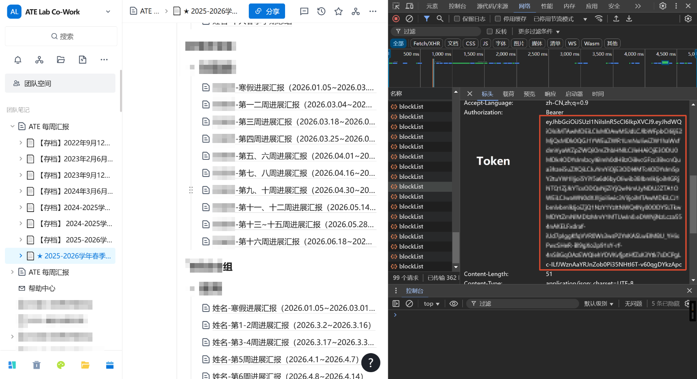
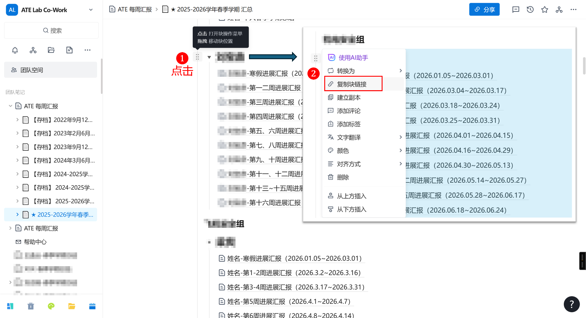

# 周报平台块导出工具

将周报平台中指定容器块下的所有子块批量导出为 PDF 文件。

## 文件说明

| 文件 | 用途 |
|------|------|
| `config.ini.example` | **配置文件模板** — 首次使用复制为 `config.ini` 并填写 |
| `config.ini` | **实际配置文件**（已加入 `.gitignore`，不提交到仓库） |
| `get_blocks.py` | **主脚本** — 运行此脚本，一般不需要修改 |
| `README.md` | 本使用说明 |

## 前置条件

- Python 3.x（使用标准库，无第三方依赖）

## 快速开始

### 1. 准备配置文件

```bash
# 将模板复制为实际配置文件
cp config.ini.example config.ini
```

### 2. 编辑 `config.ini`

填写 TOKEN 和 BLOCK_LINK：

```ini
[config]
TOKEN = eyJxxx...
BLOCK_LINK = https://note.kxsz.net/w/ff98223a-...#9c498fda-...
```

- **TOKEN**：浏览器 F12 → 网络 → 找到任意请求 → 复制 `Authorization: Bearer` 后面的值

  

- **BLOCK_LINK**：点击目标块左上角的 ☰ 控制符 → 复制块链接

  

### 3. 运行

```bash
cd d:\myutils\weekly-report-export
python get_blocks.py
```

### 4. 输出

脚本会在当前目录自动创建 `{容器标题}_pdfs/` 文件夹（如 `姓名_pdfs/`），保存所有导出的 PDF，按序号编号：

```
姓名_pdfs/
├── 01_姓名-寒假进展汇报（2026.01.05~2026.03.01）.pdf
├── 02_姓名-第一二周进展汇报（2026.03.04~2026.03.17）.pdf
├── 03_姓名-第三周进展汇报（2026.03.18~2026.03.24）.pdf
└── ...
```

## 工作原理

```
启动
 ├─ 读取 config.ini
 ├─ GET /api/user/getUserInfo     → 自动获取 uid
 ├─ GET /api/note/team/list       → 自动获取 space_id
 ├─ POST /api/note/block/list     → 获取容器块的子块 ID 列表
 ├─ POST /api/note/block/list     → 批量获取子块标题
 ├─ POST /api/note/blockExport    → 测试导出第一个子块
 └─ 循环 POST /api/note/blockExport → 导出剩余子块
```

## 注意事项

- **Token 会过期**，过期后需要从浏览器重新复制并更新 `config.ini`
- **`config.ini` 包含敏感 Token**，已加入 `.gitignore`，不会提交到 Git
- 每个导出间隔 1 秒，避免请求过快被限流
- 输出目录自动以容器块标题命名，如 `姓名_pdfs/`
-  **ATE Lab 周报平台**专用

